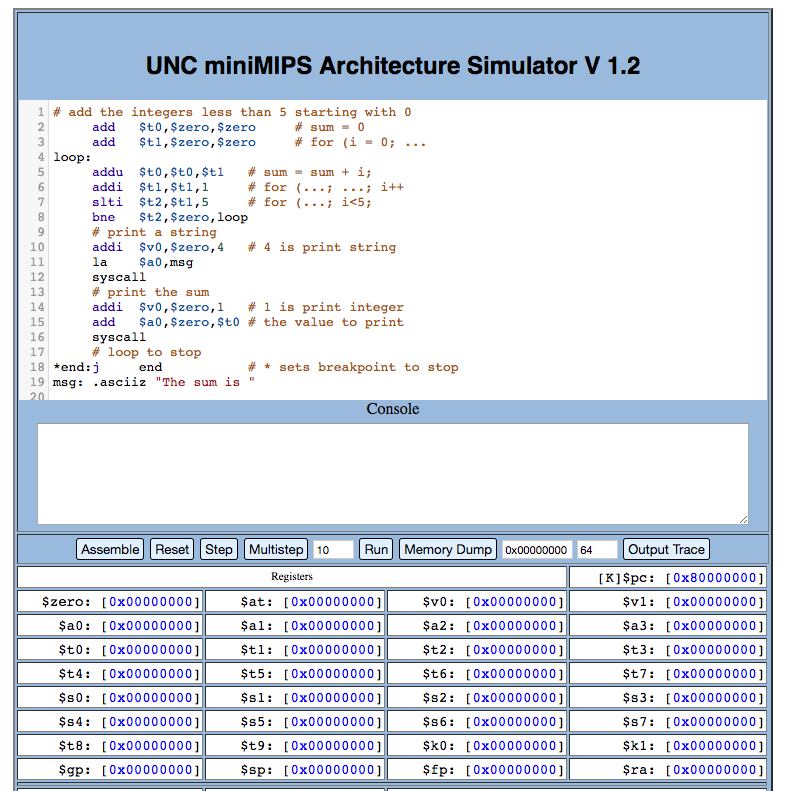

# miniMIPS/miniARM Tweaks

Prettifies [miniMIPS](http://wwwx.cs.unc.edu/Courses/comp411-002-s17/tools/mips.html) and [miniARM](http://www.csbio.unc.edu/mcmillan/miniARM.html), with keyboard shortcuts.

Uses [CodeMirror](https://codemirror.net/) 5.41.0 for syntax highlighting.

Keyboard shortcuts:

```
F1: Assemble
F2: Reset
F3: Step
F4: Run
F5: Memory Dump
F6: Output Trace
```



Disclaimer: Not thoroughly tested. Use at your own peril.

## Sources:
- Extension template from: https://gist.github.com/danharper/8364399
- Editor: [CodeMirror](https://codemirror.net/)
- MIPS syntax highlighting taken from [Brian Reber's online MIPS assembler](https://github.com/breber/mips): https://github.com/breber/mips/blob/gh-pages/js/mips.js
